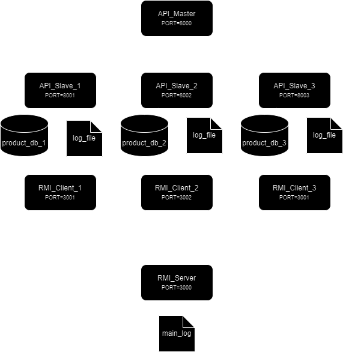

# Ejemplo Practico de Sistema Distribuido

El sistema se basa en una API que retorna información de diversos productos. Para lograr esto, se hace uso de una API maestra, la cual dirige las solicitudes hacia distintas API esclavas, cada una asociada a diferentes categorías de productos.

Adicionalmente, se cuentan con procesos demonios para cada API esclava. Estos demonios leen los archivos logs de las API y envían los nuevos registros a un servidor, el cual registra estos logs en un archivo log central.

En cuanto a la implementación de las APIs, se utilizó la biblioteca FastAPI de Python. Para los demonios, se optó por utilizar Java y RMI para la comunicación con el servidor.

## Arquitectura

